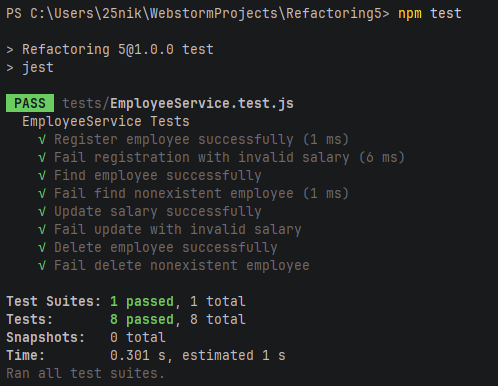

# Employee Management System

Проєкт реалізує систему управління працівниками на основі архітектури **Controller → Service → Repository**.
 
---

## Зміст

1. [Бізнес-сценарії](#бізнес-сценарії)
2. [Структура проєкту](#структура-проєкту)
3. [Структура шарів](#структура-шарів-архітектура)
4. [Встановлення та запуск](#встановлення-та-запуск)
5. [Запуск тестів](#запуск-тестів)
---

## Бізнес-сценарії

### 1. Реєстрація працівника

Система дозволяє додати нового працівника, передавши об'єкт `EmployeeDTO` із полями `name`, `department` та `salary`.

**Правила валідації:**
- Ім'я не може бути порожнім
- Відділ не може бути порожнім
- Зарплата повинна бути більшою за `0`
  При успіху повертається об'єкт `Employee` із присвоєним унікальним `id`.

---

### 2. Пошук працівника за ID

Система знаходить працівника за числовим ідентифікатором.

**Поведінка:**
- Якщо працівник знайдений — повертається його об'єкт
- Якщо не знайдений — кидається помилка `Employee not found`
---

### 3. Оновлення зарплати

Система оновлює зарплату існуючого працівника.

**Правила валідації:**
- Нова зарплата повинна бути більшою за `0`
- Працівник із вказаним `id` повинен існувати
---

### 4. Видалення працівника

Система видаляє працівника зі сховища.

**Поведінка:**
- Якщо працівник знайдений — видаляється та повертається його об'єкт
- Якщо не знайдений — кидається помилка `Employee not found`
---

### 5. Отримання всіх працівників

Система повертає масив усіх зареєстрованих працівників без додаткової валідації.
 
---

## Структура проєкту

```
Refactoring5/
├── src/
│   ├── app.js                          # Точка входу — демонстрація сценаріїв
│   ├── controllers/
│   │   └── EmployeeController.js       # Приймає запити, делегує до Service
│   ├── services/
│   │   └── EmployeeService.js          # Бізнес-логіка та валідація
│   ├── repositories/
│   │   └── EmployeeRepository.js       # Зберігання даних (in-memory масив)
│   ├── models/
│   │   └── Employee.js                 # Клас-сутність працівника
│   └── dto/
│       └── EmployeeDTO.js              # Data Transfer Object для вхідних даних
└── tests/
    └── EmployeeService.test.js         # Юніт-тести (Jest)
```
 
---

## Структура шарів (архітектура)

Проєкт побудований за трирівневою архітектурою **Controller → Service → Repository**. Кожен шар має чітко визначену відповідальність і не знає деталей реалізації сусідніх шарів.

```
┌──────────────────────────────────────────────────────┐
│                   app.js (точка входу)               │
└─────────────────────────┬────────────────────────────┘
                          │ викликає
┌─────────────────────────▼────────────────────────────┐
│              EmployeeController                      │
│  Приймає запити ззовні та делегує до сервісного шару │
│  Методи: register(), find(), updateSalary(),         │
│          delete(), getAll()                          │
└─────────────────────────┬────────────────────────────┘
                          │ делегує
┌─────────────────────────▼────────────────────────────┐
│              EmployeeService                         │
│  Містить бізнес-логіку та валідацію даних            │
│  Методи: registerEmployee(), findEmployee(),         │
│          updateSalary(), deleteEmployee(),           │
│          getAllEmployees()                            │
└─────────────────────────┬────────────────────────────┘
                          │ звертається до
┌─────────────────────────▼────────────────────────────┐
│              EmployeeRepository                      │
│  Відповідає за зберігання та пошук даних (in-memory) │
│  Методи: add(), findById(), getAll(),                │
│          updateSalary(), delete()                    │
└──────────────────────────────────────────────────────┘
```

**EmployeeDTO** — об'єкт для передачі вхідних даних від зовнішнього середовища до сервісного шару (`name`, `department`, `salary`). Дозволяє відокремити формат введення від внутрішньої моделі.

**Employee (Model)** — внутрішня сутність системи з полями `id`, `name`, `department`, `salary`. Створюється сервісом і зберігається репозиторієм.

**Переваги такої архітектури:**
- Кожен шар можна тестувати та змінювати незалежно
- Заміна `EmployeeRepository` (наприклад, з in-memory на базу даних) не потребує змін у `EmployeeService` або `EmployeeController`
- Бізнес-логіка зосереджена в одному місці — у `EmployeeService`
---

## Встановлення та запуск

### Встановлення залежностей

```bash
npm install
```

### Запуск програми

```bash
npm start
```

**Очікуваний вивід:**

```
Employees added:
Employee { id: 1, name: 'Ivan Petrenko', department: 'IT', salary: 25000 }
Employee { id: 2, name: 'Maria Kovalenko', department: 'HR', salary: 18000 }
 
Find employee:
Employee { id: 1, name: 'Ivan Petrenko', department: 'IT', salary: 25000 }
 
Update salary:
Employee { id: 1, name: 'Ivan Petrenko', department: 'IT', salary: 30000 }
 
All employees:
[
  Employee { id: 1, name: 'Ivan Petrenko', department: 'IT', salary: 30000 },
  Employee { id: 2, name: 'Maria Kovalenko', department: 'HR', salary: 18000 }
]
 
Delete employee:
Employee { id: 2, name: 'Maria Kovalenko', department: 'HR', salary: 18000 }
 
Final list:
[ Employee { id: 1, name: 'Ivan Petrenko', department: 'IT', salary: 30000 } ]
```
 
---

## Запуск тестів

```bash
npm test
```

### Перелік тест-кейсів

| № | Назва тесту | Що перевіряється | Очікуваний результат |
|---|-------------|-----------------|----------------------|
| 1 | `Register employee successfully` | Успішна реєстрація | `employee.name === 'Ivan'` |
| 2 | `Fail registration with invalid salary` | Від'ємна зарплата при реєстрації | Виняток `Invalid employee data` |
| 3 | `Find employee successfully` | Пошук існуючого працівника | `found.name === 'Ivan'` |
| 4 | `Fail find nonexistent employee` | Пошук неіснуючого `id` | Виняток `Employee not found` |
| 5 | `Update salary successfully` | Оновлення зарплати | `updated.salary === 40000` |
| 6 | `Fail update with invalid salary` | Від'ємна зарплата при оновленні | Виняток `Invalid salary` |
| 7 | `Delete employee successfully` | Успішне видалення | `repository.getAll().length === 0` |
| 8 | `Fail delete nonexistent employee` | Видалення неіснуючого `id` | Виняток `Employee not found` |

**Пояснення логіки тестів:**

- Кожен тест використовує `beforeEach` для створення нових інстансів `EmployeeRepository` та `EmployeeService`, щоб тести були ізольовані один від одного.
- Позитивні тести (`successfully`) перевіряють, що метод повертає коректні дані.
- Негативні тести (`Fail ...`) використовують `expect(() => {...}).toThrow(...)` для перевірки, що метод кидає правильний виняток при некоректних вхідних даних.
- Тест видалення додатково перевіряє стан репозиторію після операції (`repository.getAll().length === 0`), а не лише повернене значення.
---
 
---

